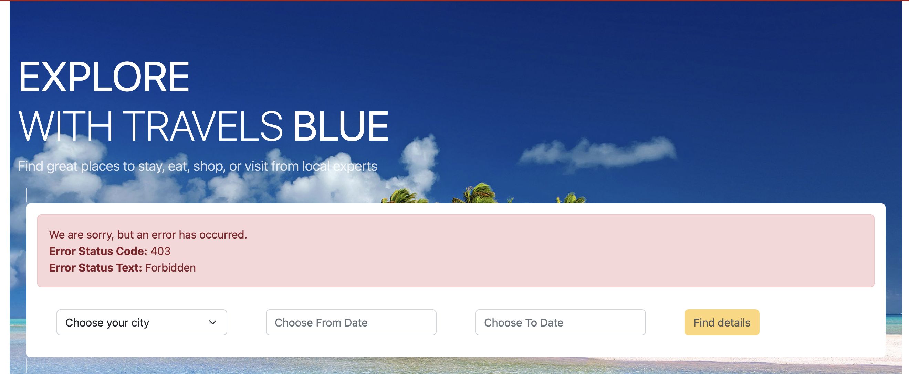
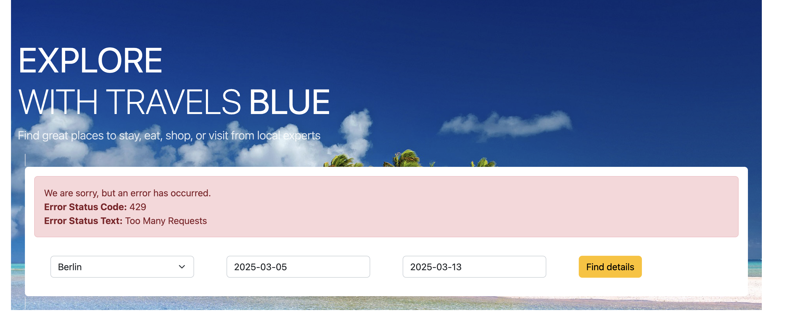

## Access the echo-api HTTPRoute


* Check setup 
```sh
echo  $CLUSTERDOMAIN 
```

* Execute and Observe: 200 successful response status code
```sh
curl -k -w "%{http_code}" https://echo.travels.$CLUSTERDOMAIN && echo
```


* Review Gateway authpolicy
```yaml
apiVersion: kuadrant.io/v1
kind: AuthPolicy
metadata:
  name: prod-web-deny-all
  namespace: ingress-gateway
spec:
  targetRef:
    group: gateway.networking.k8s.io
    kind: Gateway
    name: prod-web
  rules:
    authorization:
      deny-all:
        opa:
          rego: "allow = false"
    response:
      unauthorized:
        headers:
          "content-type":
            value: application/json
        body:
          value: |
            {
              "error": "Forbidden",
              "message": "Access denied by default by the gateway operator. If you are the administrator of the service, create a specific auth policy for the route."
            }
```

* Apply Gateway authpolicy

```sh
oc apply -f RHCL/gateway-authpolicy.yaml
```

* Test echo-api HTTPRoute. Execute and Observe: **403 Forbidden**
```sh
curl -k -w "%{http_code}" https://echo.travels.$CLUSTERDOMAIN && echo
```

* **Review Gateway Rate Limit Policy**
```yaml
apiVersion: kuadrant.io/v1
kind: RateLimitPolicy
metadata:
  name: ingress-gateway-rlp-lowlimits
  namespace: ingress-gateway
spec:
  targetRef:
    group: gateway.networking.k8s.io
    kind: Gateway
    name: prod-web
  limits:
    "default-limits":
      rates:
      - limit: 5
        window: 10s
```

*  **Create Gateway RLP**
```sh
oc apply -f RHCL/gateway-rlp.yaml
```


* Test echo-api HTTPRoute to view **Too Many Requests - 429** message after the fifth call
```sh
for i in {1..10}; do echo "($i)"; curl -k -w "%{http_code}" https://echo.travels.$CLUSTERDOMAIN; echo; done
```


* View the Topology

https://console-openshift-console.apps.cluster-pg4pk.pg4pk.sandbox4561.opentlc.com/kuadrant/policy-topology


## Developer Workflow

* Create policies to securely expose the travel-agency service endpoints

* Open Travels Portal https://travels-blue-ui-travel-web.apps.cluster-pg4pk.pg4pk.sandbox4561.opentlc.com/
```
403 - Forbidden error because while you have created
```



* **Review  HTTPRout AuthPolicy**
```yaml
apiVersion: kuadrant.io/v1
kind: AuthPolicy
metadata:
  name: travel-agency-authpolicy
  namespace: travel-agency
spec:
  defaults:
    rules:
      authentication:
        api-key-authn:
          apiKey:
            allNamespaces: false
            selector:
              matchLabels:
                app: partner
          credentials:
            queryString:
              name: APIKEY
  targetRef:
    group: gateway.networking.k8s.io
    kind: HTTPRoute
    name: travel-agency

---
apiVersion: v1
kind: Secret
metadata:
  name: apikey-blue
  namespace: kuadrant-system
  labels:
    authorino.kuadrant.io/managed-by: authorino
    app: partner
stringData:
  api_key: blue
type: Opaque
```

* **Create Gateway authpolicy**
```sh
oc apply -f RHCL/httproute-authpolicy.yaml
```


* Test if you can view the details now on the Travels Portal https://travels-blue-ui-travel-web.apps.cluster-pg4pk.pg4pk.sandbox4561.opentlc.com/


* Test the default RateLimit Policy by clicking the Find details button more than 5 times. Expect to see a 429 error:



* Review HTTPRoute RateLimit Policy
```
apiVersion: kuadrant.io/v1
kind: RateLimitPolicy
metadata:
  name: ratelimit-policy-travels
  namespace: travel-agency
spec:
  targetRef:
    group: gateway.networking.k8s.io
    kind: HTTPRoute
    name: travel-agency
  limits:
    "per-user":
      rates:
        - limit: 20
          window: 10s
      counters:
        - expression: auth.identity.userid
```

* Create a new travels specific RateLimit Policy
```sh
oc apply -f RHCL/httproute-rlp.yaml
```

* Test again https://travels-blue-ui-travel-web.apps.cluster-pg4pk.pg4pk.sandbox4561.opentlc.com/

## Observability

* Setup Monitoring
```sh
oc rollout restart deployment/kube-state-metrics-kuadrant -n monitoring
```

* Navigate to the Grafana dashboards: https://grafana-route-monitoring.apps.cluster-pg4pk.pg4pk.sandbox4561.opentlc.com/login

* Explore persona-based Dashboards

* Run workload
```sh
for i in {1..1000}; do curl -k -w "%{http_code}" https://echo.travels.sandbox4561.opentlc.com; done
```

* Check Grafana dashboard again: https://grafana-route-monitoring.apps.cluster-pg4pk.pg4pk.sandbox4561.opentlc.com/login

429 and 403 requests, as well as the total requests, are available in the different sections of the dashboard.
